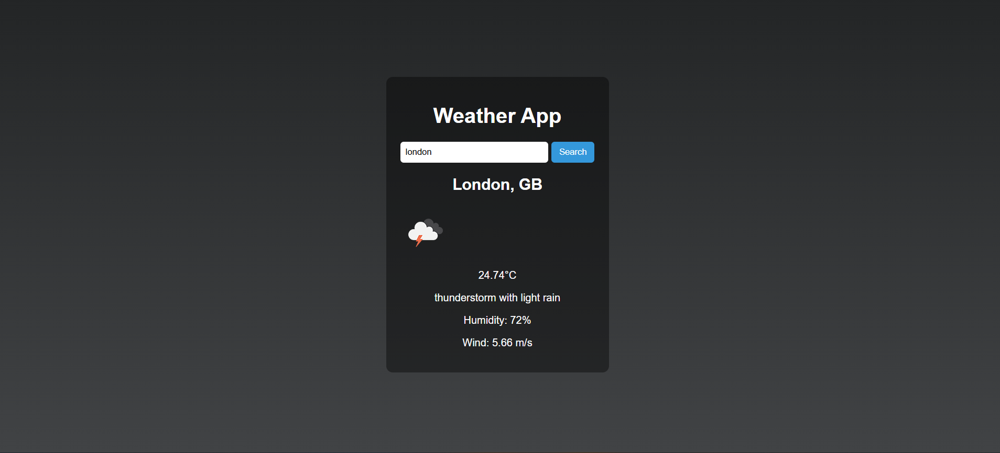

# 🌤 Minimal Weather App

[A modern, minimal, and responsive weather web application built with **HTML**, **CSS**, and **JavaScript**, using the [OpenWeatherMap API](https://openweathermap.org/).

## 📌 Features
- Search weather by **city name**
- Display:
  - Current temperature (°C)
  - Weather status (Clear, Clouds, Rain, etc.)
  - Humidity (%)
  - Wind speed (m/s)
- Weather **icon** based on API data
- **Adaptive background** that changes according to the weather condition
- Clean and minimal UI

## 🖼 Preview



## 🛠 Technologies Used
- **HTML5**
- **CSS3** (with adaptive background styles)
- **JavaScript** (ES6+)
- **OpenWeatherMap API**

## 📂 Project Structure
├── index.html # Main HTML file

├── style.css # Styles and adaptive backgrounds

├── index.js # App logic with API integration

└── README.md # Project documentation


content_copy
text

## 🚀 How to Run
1. Clone the repository:
   ```bash
   git clone https://github.com/amir-akbari361/Weather-App 
Open index.html in your browser.
 
🔑 API Key Setup
1. Get a free API key from OpenWeatherMap.

const apiKey = "YOUR_API_KEY_HERE";
Save and refresh the app.


🎨 Adaptive Background Conditions
Clear ☀️ → Blue gradient sky
Clouds ☁️ → Gray cloudy gradient
Rain 🌧 → Dark blue rainy gradient
Snow ❄️ → Cold winter tones
Thunderstorm ⛈ → Dark stormy shades
Drizzle 🌦 → Light rain tones
Mist 🌫 → Misty gray
